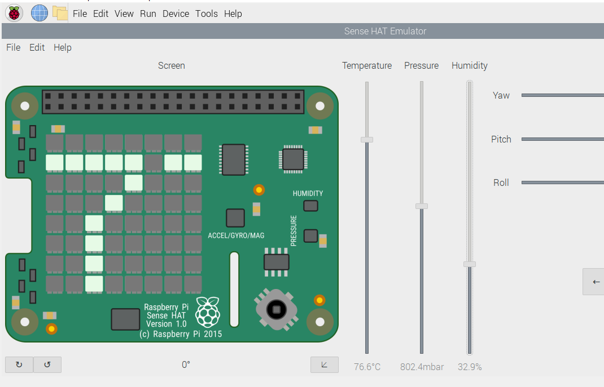
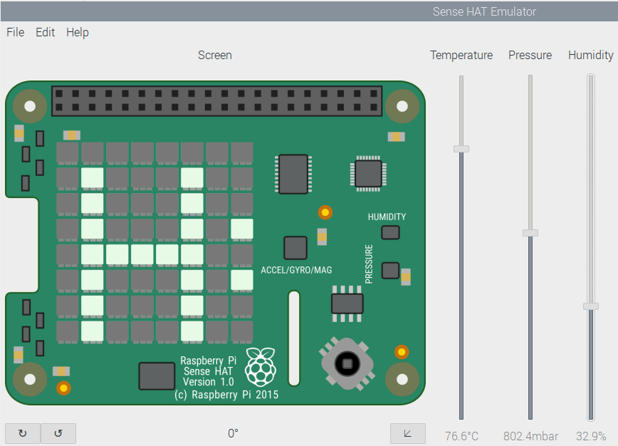

# Raspbian_Sensing_Environment
 There are three Raspbian applications in this repository. The [SensingEnvironment](SensingEnvironment.py) is used to get environmental information periodically and show them on the LED display and store them in a .txt file. The [SendEmail](SendEmail.py) do the same as previos one but send the information via email to the operator as well. In the third application [SendNotification](SendNotification.py), I used Pycurl and Json libraries to establish an API connection with Instapush and send a notification to the operator if the temperature gets colder or warmer than certain amounts. In addition I devide the LED display into two region to show the temperature.
 
  
